# Architecture

```mermaid
flowchart TB
    subgraph Browser["🌐 Viewer's Browser (port 8080)"]
        OC["owncast-pay.js<br/>(injected via Custom JavaScript)"]
        MM["MetaMask<br/>(EIP-3009 signing)"]
        WS["Temp WebSocket<br/>(identity lookup)"]
    end

    subgraph Owncast["🎥 Owncast Server (port 8080)"]
        FE["React Frontend<br/>- Registers user on page load<br/>- Stores accessToken in localStorage<br/>- Opens chat WebSocket"]
        API["Owncast REST API<br/>- POST /api/chat/register<br/>- GET /api/config"]
        WSS["Owncast WebSocket<br/>- /ws?accessToken=&lt;token&gt;<br/>- Sends CONNECTED_USER_INFO<br/>- Sends USER_JOINED/CHAT msgs"]
        WH["Webhook Engine<br/>- Fires USER_JOINED / USER_PARTED"]
    end

    subgraph Sidecar["💰 Payment Sidecar (Flask, port 8081)"]
        WEB["POST /webhook<br/>← USER_JOINED / USER_PARTED"]
        LOOKUP["GET /lookup/by-user-id/{id}<br/>→ auth_request_id"]
        SESS["GET /session/{id}<br/>→ tiers, wallet, state"]
        AUTH["POST /authorize/{id}<br/>← signed EIP-3009"]
        DECLINE["POST /decline/{id}<br/>← watch free"]
        DASHBOARD["GET /<br/>→ HTML dashboard + stats"]
        STATIC["GET /static/owncast-pay.js<br/>→ browser script"]
        REP["🔄 Reaper (every 5s)<br/>- Prunes stale sessions<br/>- Auto-settles silent viewers"]
        BG["🔄 Background Settler<br/>- Submits EIP-3009 to Arc"]
        LG[("Ledger<br/>(in-memory dict<br/>active + settled)")]
    end

    subgraph Blockchain["⛓️ Arc Testnet"]
        USDC["USDC Contract<br/>0x3600...0000"]
        TX["transferWithAuthorization()<br/>from: viewer<br/>to: streamer"]
    end

    subgraph Streamer["📡 Streamer"]
        OBS["OBS / Broadcasting<br/>Software"]
        ADMIN["Owncast Admin<br/>- Configures webhook URL<br/>- Injects browser script"]
    end

    %% Identity: Browser discovers its Owncast user ID
    OC -- "1. Reads accessToken from localStorage<br/>(set by Owncast FE on page load)" --> OC
    OC -- "2. Opens temp WebSocket /ws?accessToken=..." --> WSS
    WSS -- "3. CONNECTED_USER_INFO → user.id" --> WS
    WS -- "4. Caches user.id in _owncast_pay_uid" --> OC

    %% Discovery: Browser finds its sidecar session
    OC -- "5. GET /lookup/by-user-id/{user.id}" --> LOOKUP
    LOOKUP --> LG
    LOOKUP -- "auth_request_id" --> OC

    %% Owncast fires webhooks to sidecar
    WH -- "USER_JOINED / USER_PARTED" --> WEB
    WEB --> LG

    %% Poll and authorize
    OC -- "6. Polls GET /session/{id}" --> SESS
    SESS --> LG
    SESS -- "state: needs_auth, tiers, streamer_wallet" --> OC
    OC -- "7. Shows tier modal" --> OC
    OC -- "8. eth_requestAccounts +<br/>eth_signTypedData_v4" --> MM
    MM -- "9. Signed EIP-3009<br/>(from, to, value, nonce, v, r, s)" --> OC
    OC -- "10. POST /authorize/{id}" --> AUTH
    AUTH -- "Verifies signature → recovers signer" --> AUTH
    AUTH --> LG
    AUTH -- "ok: true" --> OC

    %% Decline path
    OC -- "ALT: POST /decline/{id}" --> DECLINE
    DECLINE --> LG

    %% Heartbeat
    OC -- "Every 10s: GET /session/{id}<br/>(keeps session alive)" --> SESS

    %% Settlement on USER_PARTED
    WEB -- "On USER_PARTED: if AUTHORIZED" --> BG
    BG -- "settle_authorization()<br/>web3.py → transferWithAuthorization" --> USDC
    USDC -- "Transaction receipt" --> BG
    BG --> LG

    %% Reaper
    REP --> LG

    %% Setup
    ADMIN -- "Configures webhook URL<br/>http://localhost:8081/webhook" --> WH
    ADMIN -- "Pastes browser script<br/>curl .../owncast-pay.js | pbcopy" --> OC

    OBS -- "RTMP stream" --> Owncast

    %% Styling
    classDef browser fill:#e1f5fe,stroke:#0288d1,color:#000
    classDef owncast fill:#fff3e0,stroke:#f57c00,color:#000
    classDef sidecar fill:#e8f5e9,stroke:#388e3c,color:#000
    classDef blockchain fill:#f3e5f5,stroke:#7b1fa2,color:#000
    classDef streamer fill:#fce4ec,stroke:#c62828,color:#000
    class OC,MM,WS browser
    class FE,API,WSS,WH,Owncast owncast
    class WEB,LOOKUP,SESS,AUTH,DECLINE,DASHBOARD,STATIC,REP,BG,LG,Sidecar sidecar
    class USDC,TX blockchain
    class OBS,ADMIN,Streamer streamer
```



## Servers

### 🎥 Owncast Server (port 8080)

The live streaming server. Runs the stream + chat. When a viewer loads the page, its React frontend registers the viewer as a chat user, stores the `accessToken` in `localStorage`, and opens a WebSocket. It fires `USER_JOINED` / `USER_PARTED` webhooks to the sidecar whenever someone enters or leaves.

### 💰 Payment Sidecar (Flask, port 8081)

The core of the project. A Flask server that:

- **Receives webhooks** from Owncast (`USER_JOINED` → creates a pending session, `USER_PARTED` → triggers settlement)
- **Serves the browser script** via `/static/owncast-pay.js`
- **Exposes session lookup** (`/lookup/by-user-id/{id}`) so the browser can discover its auth request
- **Handles authorization** — the browser sends a signed EIP-3009 authorization, the sidecar verifies the signature
- **Settles on-chain** — when a viewer parts, submits the pre-signed USDC transfer to Arc Testnet via `web3.py`
- **Reaps stale sessions** — a background thread prunes viewers who left without a clean parting event
- **Dashboards** — live HTML dashboard at `/` showing active viewers, earnings, settled transactions

### ⛓️ Arc Testnet (Blockchain)

The settlement chain (Canteen-hosted RPC). The USDC contract (`0x3600...0000`) is called with `transferWithAuthorization()` — the pre-signed authorization from the viewer's MetaMask. The streamer's wallet pays gas (~$0.0001) and receives the USDC.

### 🌐 Viewer's Browser

Runs `owncast-pay.js` injected by the streamer. The script:

1. Reads the `accessToken` Owncast's frontend already stored in `localStorage`
2. Opens a temporary WebSocket to Owncast to grab the `user.id` from `CONNECTED_USER_INFO`
3. Discovers its sidecar session via `/lookup/by-user-id/{id}`
4. Shows a tier selection modal when the sidecar says `needs_auth`
5. Connects MetaMask, switches to Arc Testnet, signs an EIP-3009 authorization for gasless USDC transfer
6. Sends the signed authorization to the sidecar
7. Sends heartbeats every 10s to keep the session alive

## Full Flow (step by step)

| Step | From | To | What happens |
|---|---|---|---|
| **Setup** | Streamer | Admin | Configures webhook URL `http://localhost:8081/webhook` in Owncast Admin, pastes the browser script |
| **1** | Browser | Owncast FE | Loads the stream page. Owncast's frontend calls `POST /api/chat/register`, stores `accessToken` in localStorage |
| **2** | Owncast | Sidecar | Fires `USER_JOINED` webhook → sidecar creates a `Session` with `auth_status: PENDING` |
| **3** | Browser | Owncast WS | Opens temp WebSocket with the accessToken, receives `CONNECTED_USER_INFO` → extracts `user.id` |
| **4** | Browser | Sidecar | Calls `GET /lookup/by-user-id/{id}` → gets back `auth_request_id` |
| **5** | Browser | Sidecar | Polls `GET /session/{id}` every 2s. Sidecar returns `state: needs_auth` with tiers and wallet info |
| **6** | Browser | — | Shows tier selection modal. User picks a tier |
| **7** | Browser | MetaMask | Calls `eth_requestAccounts` → `wallet_switchEthereumChain` (to Arc) → `eth_signTypedData_v4` with the EIP-3009 payload |
| **8** | Browser | Sidecar | Sends signed authorization via `POST /authorize/{id}`. Sidecar verifies EIP-712 signature, stores it, sets `auth_status: AUTHORIZED` |
| **9** | Browser | Sidecar | (Alternative) User clicks "Watch free" → `POST /decline/{id}` → `auth_status: DECLINED` |
| **—** | Browser | Sidecar | Heartbeat: `GET /session/{id}` every 10s to avoid reaper |
| **10** | Owncast | Sidecar | Fire `USER_PARTED` webhook. Sidecar archives session, calculates duration |
| **11** | Sidecar | Arc | If `AUTHORIZED`: background thread calls `settle_authorization()` → builds `transferWithAuthorization` txn → signs with streamer's key → submits to USDC contract on Arc |
| **12** | Sidecar | — | Status → `SETTLED`. Transaction hash stored. Dashboard updates |
| **—** | Sidecar | — | Reaper runs every 5s, prunes sessions without heartbeat for 30s, auto-settles them |

## State Machine

```
        USER_JOINED
            │
            ▼
        PENDING ◄──────────── reaper (30s stale without heartbeat)
        │    │
        │    ├── /authorize (signed EIP-3009) ──► AUTHORIZED
        │    │
        │    └── /decline  ─────────────────────► DECLINED
        │
        │  (USER_PARTED before authorize)
        ▼
     no charge
        │
        ▼
   AUTHORIZED + USER_PARTED ──► settle_authorization() ──► SETTLED
                                      │
                                      ▼
                                  Arc Testnet
                              USDC transferred
                           (streamer pays gas)
```

## File Map

```
hackathon-micro-payments/
├── architecture.md          ← this file
├── README.md               ← project overview, quickstart
├── PLAN.md                 ← hackathon build plan
├── config.py               ← environment config (wallet, chain, tiers)
├── models.py               ← Session, Ledger, AuthStatus dataclasses
├── settle.py               ← web3.py EIP-3009 on-chain submission
├── sidecar.py              ← Flask server (webhooks, API, dashboard)
├── test_sidecar.py         ← end-to-end smoke tests
├── static/
│   └── owncast-pay.js      ← browser-injected payment script
└── requirements.txt
```
